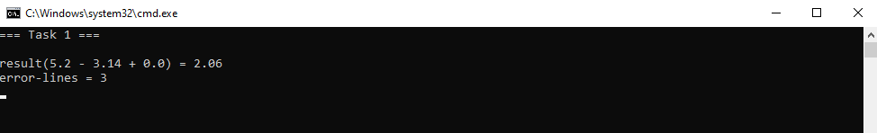
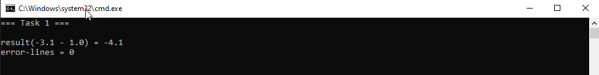
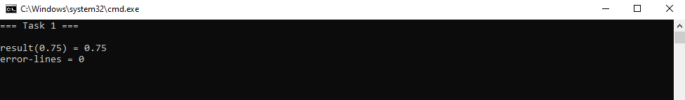
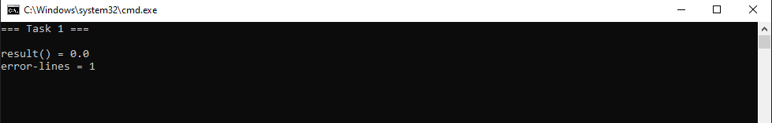
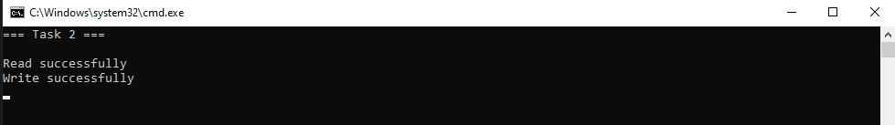

## EPAM, spring 2019, external lab
### 03 Strings

#### Using:   
- .NET Framework 4.8   

#### To open tasks [click here][link].    
[link]:</docs/03_strings.pdf>  

#### Results:   
    
   
   
   
   
